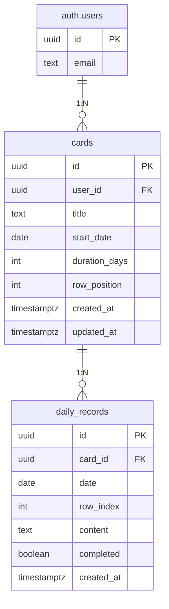

## 1. 架构设计

```mermaid
graph TB
    subgraph "前端 (Next.js App Router)"
        "登录/注册页"
        "时间轴工作台"
    end
    subgraph "Supabase"
        "Auth 认证服务"
        "PostgreSQL 数据库"
        "RLS 行级安全"
    end
    "前端 (Next.js App Router)" --> "Auth 认证服务"
    "前端 (Next.js App Router)" --> "PostgreSQL 数据库"
    "Auth 认证服务" --> "PostgreSQL 数据库"
    "RLS 行级安全" --> "PostgreSQL 数据库"
```

## 2. 技术说明

- **前端**：Next.js 15 (App Router) + React 19 + TypeScript + Tailwind CSS v4
- **初始化工具**：create-next-app
- **后端**：Supabase（Auth + PostgreSQL + RLS），无自建后端
- **认证**：Supabase Auth（邮箱 + 密码），关闭邮箱验证，JWT 持久会话
- **数据库**：Supabase PostgreSQL，通过 RLS 保证数据隔离
- **部署**：Vercel

### 2.1 关键技术选型

| 技术 | 用途 | 原因 |
|------|------|------|
| Next.js App Router | 全栈框架 | SSR/SSG 支持，API Routes，与 Supabase SSR 集成最佳 |
| @supabase/ssr | Supabase SSR 客户端 | 支持 Server Components 中的 cookie-based 认证 |
| 原生 pointer events | 拖拽/拉伸交互 | 无需重型拖拽库，原生事件更轻量精确 |
| Zustand | 客户端状态管理 | Card 位置、拖拽状态等 UI 临时状态 |

## 3. 路由定义

| 路由 | 用途 |
|------|------|
| `/login` | 登录/注册页（未登录时自动跳转） |
| `/` | 时间轴工作台（主界面，需登录） |
| `/api/auth/callback` | Supabase Auth 回调 |

## 4. API 定义

### 4.1 Server Actions

| Action | 参数 | 返回值 | 描述 |
|--------|------|--------|------|
| `signInWithEmail` | email, password | `{ error?: string }` | 邮箱密码登录 |
| `signUpWithEmail` | email, password | `{ error?: string }` | 邮箱密码注册 |
| `signOut` | — | redirect | 退出登录 |

### 4.2 数据操作（通过 Supabase 客户端直连）

所有 CRUD 操作通过 Supabase 客户端完成，利用 RLS 保证安全：

| 操作 | 表 | 描述 |
|------|-----|------|
| SELECT | cards, daily_records | 读取当前用户的 Card 和记录 |
| INSERT | cards | 创建新 Card |
| UPDATE | cards | 更新 Card 属性（标题、日期、持续天数、行位置） |
| DELETE | cards | 删除 Card（级联删除关联记录） |
| INSERT | daily_records | 新增每日记录 |
| UPDATE | daily_records | 更新记录内容或完成状态 |
| DELETE | daily_records | 删除记录 |

## 5. 服务端架构图

无自建后端。前端通过 Supabase JS SDK 直连 Supabase，Server Components 通过 service client 访问，Client Components 通过 anon key + RLS 访问。

## 6. 数据模型

### 6.1 数据模型定义



### 6.2 数据定义语言

```sql
-- cards 表
create table if not exists public.cards (
  id uuid primary key default gen_random_uuid(),
  user_id uuid not null references auth.users(id) on delete cascade,
  title text not null default '新任务',
  start_date date not null default current_date,
  duration_days int not null default 7 check (duration_days >= 1),
  row_position int not null default 0,
  color_index int not null default 0,
  created_at timestamptz not null default now(),
  updated_at timestamptz not null default now()
);

alter table public.cards enable row level security;

create policy "Users can CRUD own cards"
  on public.cards for all
  using (auth.uid() = user_id)
  with check (auth.uid() = user_id);

create index cards_user_id_idx on public.cards(user_id, row_position);

-- daily_records 表
create table if not exists public.daily_records (
  id uuid primary key default gen_random_uuid(),
  card_id uuid not null references public.cards(id) on delete cascade,
  date date not null,
  row_index int not null default 0,
  content text not null default '',
  completed boolean not null default false,
  created_at timestamptz not null default now()
);

alter table public.daily_records enable row level security;

create policy "Users can CRUD own daily_records"
  on public.daily_records for all
  using (
    exists (
      select 1 from public.cards
      where cards.id = daily_records.card_id
      and cards.user_id = auth.uid()
    )
  )
  with check (
    exists (
      select 1 from public.cards
      where cards.id = daily_records.card_id
      and cards.user_id = auth.uid()
    )
  );

create index daily_records_card_id_date_idx
  on public.daily_records(card_id, date, row_index);

-- updated_at 自动更新触发器
create or replace function public.update_updated_at()
returns trigger
language plpgsql
as $$
begin
  new.updated_at = now();
  return new;
end;
$$;

create trigger cards_updated_at
  before update on public.cards
  for each row execute procedure public.update_updated_at();
```

## 7. 项目结构

```
planmate/
├── src/
│   ├── app/
│   │   ├── layout.tsx              # 根布局
│   │   ├── page.tsx                # 时间轴工作台（主页面）
│   │   ├── login/page.tsx          # 登录/注册页
│   │   ├── api/auth/callback/      # Supabase Auth 回调
│   │   │   └── route.ts
│   │   ├── actions/
│   │   │   └── auth.ts             # 登录/注册/登出 server actions
│   │   └── globals.css             # 全局样式
│   ├── components/
│   │   ├── timeline/
│   │   │   ├── timeline-view.tsx   # 时间轴容器（日期表头 + 滚动区域）
│   │   │   ├── date-header.tsx     # 日期表头行
│   │   │   ├── timeline-grid.tsx   # 网格背景 + 今日线
│   │   │   ├── card.tsx            # 单个 Card 组件
│   │   │   ├── card-title.tsx      # Card 标题（双击编辑）
│   │   │   ├── daily-cell.tsx      # 每日记录格（双击编辑 + 勾选）
│   │   │   └── today-line.tsx      # 今日竖线
│   │   └── auth/
│   │       └── auth-form.tsx       # 登录/注册表单
│   ├── hooks/
│   │   ├── use-card-drag.ts        # Card 拖拽 hook
│   │   ├── use-card-resize.ts      # Card 边缘拉伸 hook
│   │   └── use-timeline-scroll.ts  # 时间轴滚动控制
│   ├── stores/
│   │   └── timeline-store.ts       # Zustand 状态管理
│   ├── lib/
│   │   ├── supabase/
│   │   │   ├── client.ts           # 浏览器端 Supabase 客户端
│   │   │   ├── server.ts           # 服务端 Supabase 客户端
│   │   │   └── middleware.ts       # Proxy 中间件 session 刷新
│   │   └── utils.ts                # 日期工具函数等
│   └── proxy.ts                    # Next.js 路由保护中间件
├── migrations/
│   └── 001_init.sql                # 数据库初始化 SQL
├── .env.example                    # 环境变量示例
├── next.config.ts                  # Next.js 配置
├── tailwind.config.ts              # Tailwind 配置
├── tsconfig.json                   # TypeScript 配置
└── package.json
```
